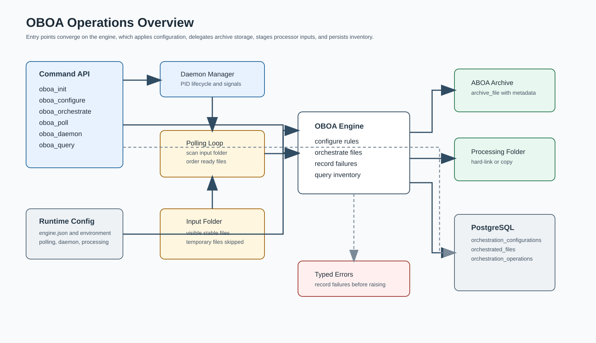
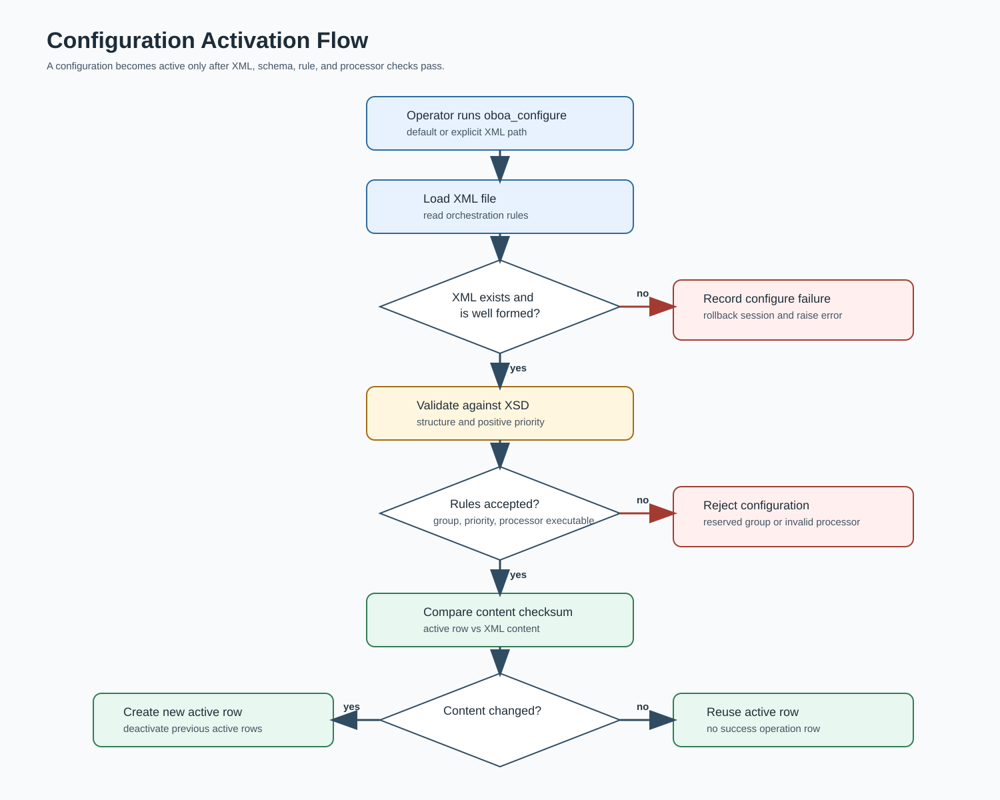
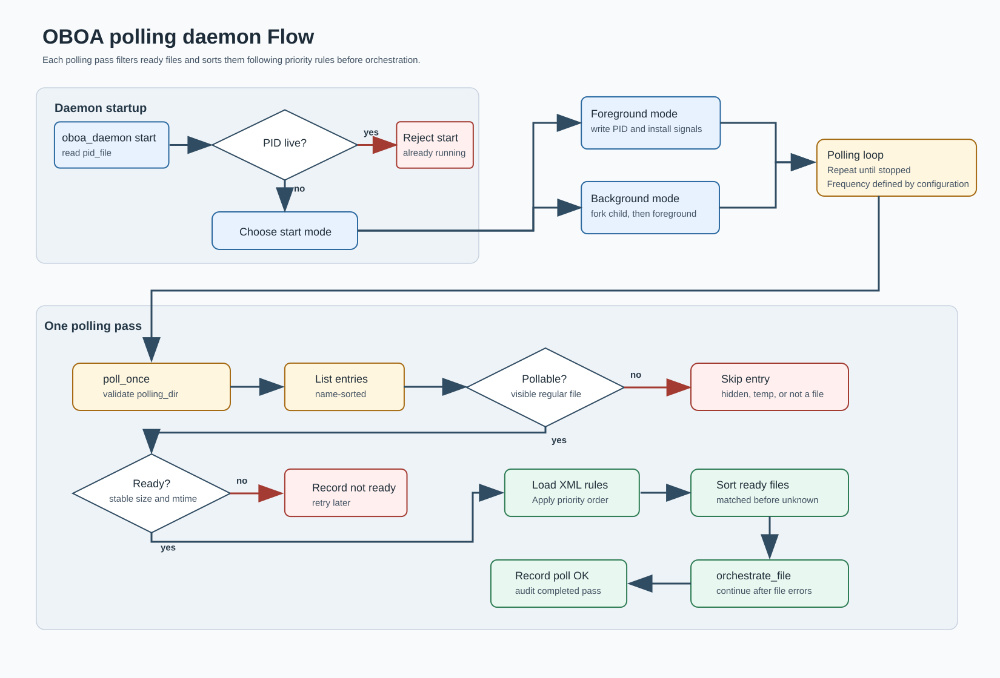
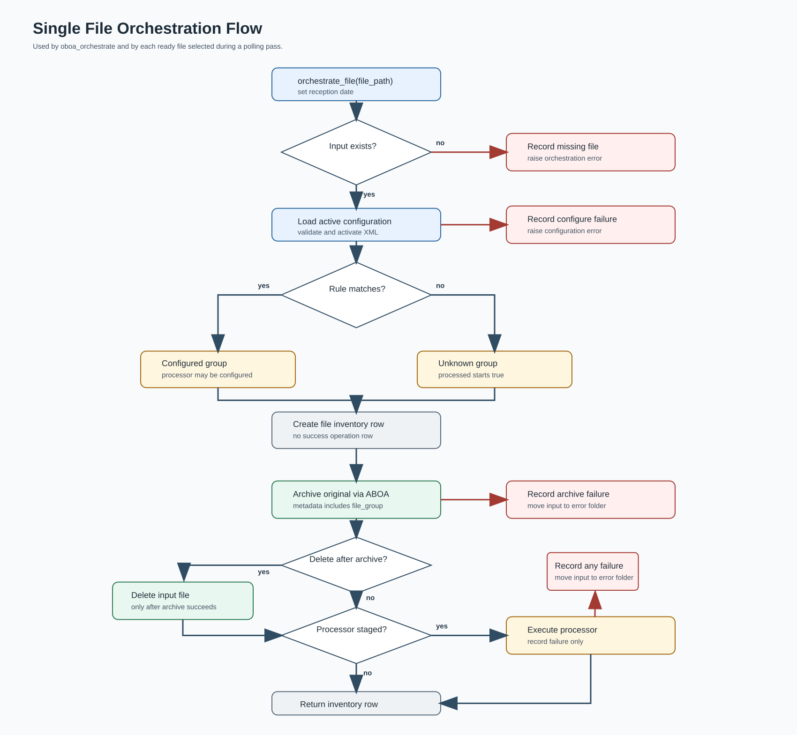
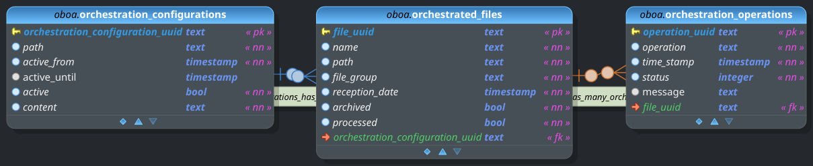

# OBOA

Orchestrator for Business Operations Analysis.

OBOA polls an input directory, matches ready files against XML orchestration
rules, delegates archival storage to ABOA, optionally stages files for executable
data processors, and keeps a PostgreSQL inventory of configuration history,
orchestrated files, and failed operations. The current implementation exposes
command line tools and Python interfaces through `oboa.engine.engine.Engine` and
`oboa.engine.query.Query`.

## Contents

- [What OBOA Provides](#what-oboa-provides)
- [Quick Start With Docker](#quick-start-with-docker)
- [Local Python Setup](#local-python-setup)
- [Runtime Configuration](#runtime-configuration)
- [Orchestration Configuration XML](#orchestration-configuration-xml)
- [Command Line Tools](#command-line-tools)
- [Python API](#python-api)
- [Operation Flow Schematics](#operation-flow-schematics)
- [Data Model](#data-model)
- [Development Layout](#development-layout)
- [Tests](#tests)

## What OBOA Provides

- Poll an input directory once, continuously, or through a managed daemon.
- Validate and activate XML orchestration configurations.
- Match files by mask using lxml XPath evaluation and OBOA XPath helper
  functions.
- Sort ready files by configured orchestration priority before processing each
  polling pass.
- Delegate archival storage to ABOA and pass the matched OBOA file group as
  archive metadata.
- Optionally delete input files after successful archive delegation.
- Stage processor-backed files into a configurable internal processing folder by
  hard-linking when possible and copying when hard-linking is not available.
- Execute configured data processors with OBOA environment variables describing
  the orchestrated file, staged path, group, and configuration UUID.
- Move failed archived or staged inputs out of the entry point into
  `<error_dir>/<YEAR>/<MONTH>/<DAY>/<file_name>`, so failed inputs are not
  orchestrated repeatedly.
- Keep PostgreSQL inventory rows for active and historical orchestration
  configurations and orchestrated files.
- Record failed operations in `orchestration_operations` while successful
  operations are written only to the log.

## Quick Start With Docker

The development compose file starts an OBOA container and a PostgreSQL/PostGIS
database container. The source checkout is mounted into the OBOA container at
`/oboa`, and the container user can be mapped to the host user with
`UID_HOST_USER` and `GID_HOST_USER`.

```bash
UID_HOST_USER=$(id -u) GID_HOST_USER=$(id -g) docker compose -f compose_dev.yml up -d --build
docker compose -f compose_dev.yml exec oboa initialize_oboa_ddbb.sh
docker compose -f compose_dev.yml exec oboa oboa_configure.py --configuration /oboa/src/tests/inputs/orchestrator_texts_without_processor.xml
docker compose -f compose_dev.yml exec oboa oboa_query.py --configurations --active true
```

`initialize_oboa_ddbb.sh` calls `oboa_init.py -y` and recreates the configured
database from `src/oboa/datamodel/oboa_data_model.sql`, so it deletes existing
OBOA inventory data for that database.

OBOA archives through ABOA by default. For orchestration commands that archive
files, make sure the ABOA package or source tree is available in the container
and that ABOA runtime configuration is valid.

## Local Python Setup

For local development outside Docker, install the package from `src/setup.py`:

```bash
python3 -m venv .venv
source .venv/bin/activate
python -m pip install -e "src[tests]"
```

Set the runtime paths before importing or running OBOA:

```bash
export OBOA_RESOURCES_PATH="$PWD/src/oboa/config"
export OBOA_SCHEMAS_PATH="$PWD/src/oboa/schemas"
export OBOA_LOG_PATH="$PWD/log"
export OBOA_POLLING_DIR="/tmp/oboa_polling"
export OBOA_PROCESSING_DIR="/tmp/oboa_processing"
export OBOA_ERROR_DIR="/tmp/oboa_error"
mkdir -p "$OBOA_LOG_PATH" "$OBOA_POLLING_DIR" "$OBOA_PROCESSING_DIR" "$OBOA_ERROR_DIR"
```

OBOA uses PostgreSQL for inventory persistence. For local runs outside Compose,
point OBOA to the PostgreSQL host:

```bash
export OBOA_DDBB_HOST="localhost"
```

ABOA must also be configured when using the default archive delegation client.
Tests can inject a mock archive client, but production orchestration uses ABOA.

## Runtime Configuration

OBOA reads JSON and XML runtime resources from the packaged `config` directory by
default. The packaged resource and schema paths can be overridden when running in
Docker, tests, or custom deployments.

Path environment variables:

- `OBOA_RESOURCES_PATH`: directory containing `datamodel.json`, `engine.json`,
  and `orchestrator_configuration.xml`.
- `OBOA_SCHEMAS_PATH`: directory containing
  `oboa_orchestrator_configuration.xsd`.
- `OBOA_LOG_PATH`: directory where rotating log files are written.

Optional environment variables:

- `OBOA_DDBB_HOST`: overrides the PostgreSQL host from `datamodel.json`.
- `OBOA_LOG_LEVEL`: overrides the log level from `engine.json`.
- `OBOA_STREAM_LOG`: enables stream logging in addition to the rotating file log.
- `OBOA_LOG_MAX_BYTES` and `OBOA_LOG_MAX_BACKUP`: override log rotation limits.
- `OBOA_POLLING_DIR`: overrides `ORCHESTRATION.polling_dir`.
- `OBOA_POLLING_FREQUENCY`: overrides `ORCHESTRATION.polling_frequency`.
- `OBOA_DELETE_AFTER_ARCHIVE`: overrides
  `ORCHESTRATION.delete_after_archive`.
- `OBOA_PROCESSING_DIR`: overrides `ORCHESTRATION.processing_dir`.
- `OBOA_ERROR_DIR`: overrides `ORCHESTRATION.error_dir`.
- `OBOA_DAEMON_PID_FILE`: overrides `DAEMON.pid_file`.
- `OBOA_DAEMON_DATABASE_STARTUP_ATTEMPTS`: number of database readiness checks
  before daemon startup fails.
- `OBOA_DAEMON_DATABASE_STARTUP_WAIT_SECONDS`: delay between database readiness
  checks.
- `OBOA_DDBB_STARTUP_ATTEMPTS` and `OBOA_DDBB_STARTUP_WAIT_SECONDS`: accepted
  aliases for the daemon database readiness retry settings.

`src/oboa/config/engine.json` configures logging, polling, staging, failed-input
storage, and daemon startup behavior:

```json
{
  "LOG": {
    "LEVEL": "INFO",
    "MAX_BYTES": 50000000,
    "MAX_BACKUP": 30
  },
  "ORCHESTRATION": {
    "polling_dir": "/oboa_polling",
    "polling_frequency": 30,
    "delete_after_archive": true,
    "processing_dir": "/oboa_processing",
    "error_dir": "/oboa_error"
  },
  "DAEMON": {
    "pid_file": "/tmp/oboa.pid",
    "database_startup_attempts": 30,
    "database_startup_wait_seconds": 2
  }
}
```

Failed input files are moved below the configured error folder using:

```text
<error_dir>/<YEAR>/<MONTH>/<DAY>/<file_name>
```

If a file with the same name already exists for the same day, OBOA appends a UUID
suffix to keep the failed input collision-safe.

## Orchestration Configuration XML

The default configuration lives at
`src/oboa/config/orchestrator_configuration.xml`. OBOA validates this file with
`src/oboa/schemas/oboa_orchestrator_configuration.xsd`.

```xml
<orchestrator_configuration>
  <data group="documents" priority="1">
    <data_mask>*.pdf</data_mask>
    <data_processor>eboa_triggering.py -r -f %F</data_processor>
  </data>
  <data group="images" priority="2">
    <data_mask>*.png</data_mask>
  </data>
</orchestrator_configuration>
```

Each `data` rule has:

- `group`: file group assigned to matching files and passed to ABOA metadata.
- `priority`: positive integer used to sort ready files before orchestration.
  Lower values run first.
- `data_mask`: file-name mask evaluated by OBOA XPath helper functions.
- `data_processor`: optional executable or command template invoked after
  successful archive delegation.

The group `unknown` is reserved. Files that do not match any configured rule are
orchestrated with file group `unknown` and are processed after matched files.

When two ready files match rules with the same priority, OBOA preserves XML rule
order and then file-name order. OBOA logs the polled files and the priority-sorted
files on every polling pass.

Processor executables may be absolute paths, paths relative to the XML
configuration file, or command names available in `PATH`. Processor command
templates may include parameters. `%F` is replaced with the staged processing
file path before execution:

```xml
<data_processor>eboa_triggering.py -r -f %F</data_processor>
```

For backward compatibility, a processor configured as a bare executable without
`%F` receives the staged file path as its final argument. Processors also receive
these environment variables:

- `OBOA_FILE_UUID`
- `OBOA_FILE_PATH`
- `OBOA_INPUT_PATH`
- `OBOA_PROCESSING_PATH`
- `OBOA_FILE_NAME`
- `OBOA_FILE_GROUP`
- `OBOA_CONFIGURATION_UUID`

## Command Line Tools

The package installs these console commands:

```bash
oboa_init.py [-f /path/to/oboa_data_model.sql] [-y]
oboa_configure.py [--configuration /path/to/orchestrator_configuration.xml]
oboa_orchestrate.py --file /path/to/file [--configuration XML] [--delete-after-archive | --keep-input] [--processing-dir DIR]
oboa_poll.py [--once] [--polling-dir DIR] [--polling-frequency SECONDS] [--configuration XML] [--delete-after-archive | --keep-input] [--processing-dir DIR]
oboa_daemon.py {start|stop|restart|status} [--pid-file FILE] [--foreground] [--polling-dir DIR] [--polling-frequency SECONDS] [--configuration XML]
oboa_query.py (--files | --configurations | --operations) [filters]
```

Common examples:

```bash
oboa_init.py -y
oboa_configure.py --configuration /data/config/orchestrator_configuration.xml
oboa_orchestrate.py --file /data/incoming/report.txt --keep-input
oboa_poll.py --once --polling-dir /data/incoming
oboa_poll.py --polling-dir /data/incoming --polling-frequency 5
oboa_daemon.py start --foreground --polling-dir /data/incoming
oboa_daemon.py status
oboa_daemon.py stop
oboa_query.py --files --name "%.txt" --order-by reception_date --descending
oboa_query.py --operations --operation archive --status 10
```

`oboa_query.py` supports these entities:

- `--files`: query `orchestrated_files`.
- `--configurations`: query `orchestration_configurations`.
- `--operations`: query failed operation rows in `orchestration_operations`.

Common query controls include `--uuid`, `--name`, `--path`, `--file-group`,
`--operation`, `--status`, `--active`, `--archived`, `--processed`,
`--selection`, `--order-by`, `--descending`, `--group-by`, `--limit`, and
`--offset`. Run any command with `--help` for the exact supported options.

## Python API

Use `Engine` for mutating orchestration operations and `Query` for read-only
inventory access.

```python
from oboa.engine.engine import Engine
from oboa.engine.query import Query

engine = Engine()
try:
    engine.configure_orchestrator("/data/config/orchestrator_configuration.xml")
    row = engine.orchestrate_file("/data/incoming/report.txt")
finally:
    engine.close_session()

query = Query()
try:
    files = query.get_orchestrated_files(
        names={"filter": "%.txt", "op": "like"},
        order_by={"field": "reception_date", "descending": True},
    )
    failures = query.get_orchestration_operations(
        operations={"filter": "archive", "op": "like"}
    )
finally:
    query.close_session()
```

Important write-side methods include `configure_orchestrator`,
`orchestrate_file`, `poll_once`, `run_polling_loop`, `run_daemon`,
`validate_daemon_startup`, `prepare_processing_file`, and
`move_to_error_folder`.

Important query methods include `get_active_orchestration_configuration`,
`get_orchestrated_files`, `get_orchestration_configurations`, and
`get_orchestration_operations`.

## Operation Flow Schematics

### Operations Overview



### Configuration Activation



### Daemon Polling And Priority



### File Orchestration



## Data Model

The DDBB model, stored in `src/oboa/datamodel/oboa_data_model.dbm`, is built
using pgModeler. The tool is then used to generate the SQL instructions, stored
in `src/oboa/datamodel/oboa_data_model.sql`, to initialize the DDBB.



Main inventory tables:

- `orchestration_configurations`: active and historical XML configuration
  snapshots.
- `orchestrated_files`: input file inventory, matched group, archive status,
  processor status, reception timestamp, and configuration UUID.
- `orchestration_operations`: failed operation records for configuration,
  polling, orchestration, archive, processing, and daemon-related failures.

## Development Layout

- `src/oboa/datamodel`: SQLAlchemy model, database configuration, exported SQL,
  and pgModeler model.
- `src/oboa/engine`: orchestration, archive delegation, query, daemon,
  configuration, XPath, and CLI logic.
- `src/oboa/processors`: executable data-processor helpers.
- `src/oboa/config`: default runtime configuration.
- `src/oboa/schemas`: bundled OBOA XML schemas.
- `src/oboa/scripts`: console script entry points and database initialization
  helpers.
- `src/tests`: pytest-based test suite and persistent test inputs.
- `development_plans`: design notes, requirements, and operation flow details.
- `doc/fig`: data model and operation-flow diagrams.

## Tests

Install the test extra and run the suite from the repository root:

```bash
python -m pip install -e "src[tests]"
export OBOA_RESOURCES_PATH="$PWD/src/oboa/config"
export OBOA_SCHEMAS_PATH="$PWD/src/oboa/schemas"
export OBOA_LOG_PATH="$PWD/log"
export OBOA_POLLING_DIR="/tmp/oboa_polling"
export OBOA_PROCESSING_DIR="/tmp/oboa_processing"
export OBOA_ERROR_DIR="/tmp/oboa_error"
mkdir -p "$OBOA_LOG_PATH" "$OBOA_POLLING_DIR" "$OBOA_PROCESSING_DIR" "$OBOA_ERROR_DIR"
python -m pytest src/tests
```

The integration tests that exercise OBOA through ABOA are skipped when the ABOA
package is not available.
